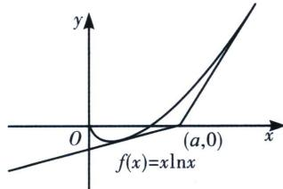

> [!faq]- 《导数专题(上)》例题解析
>
> > [!success]- **【答案】** B
>
> > [!note]- **【分析】**
> > 本题未单列分析。
>
> > [!note]- **【解析】**
> > 解析 由于 $f''(x)=\frac{1}{x}\neq0$ ，故本函数没有拐点，那么只能参考函数的零点，显然当a<0时，过点A(a,0)仅能作一条近切线，当0<a<1时，过点A(a,0)不能作切线，当a=1时，仅能做一条切线，当a>1时，能作两条切线，如图所示，则实数a的取值范围是： $(1,+\infty)$ 。故选B.
> > 
