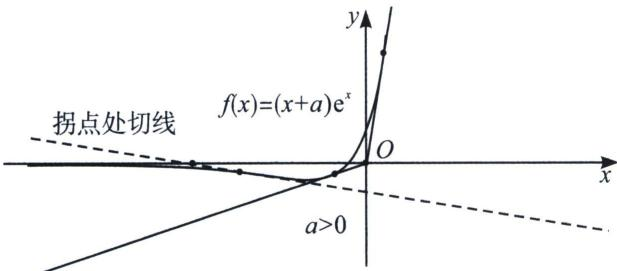
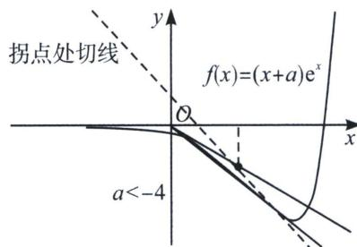

> [!faq]- 《导数专题(上)》例题解析
>
> > [!success]- **【答案】** A
>
> > [!note]- **【分析】**
> > 本题未单列分析。
>
> > [!note]- **【解析】**
> > 解析 设切点 $(x_{0},(x_{0}+a)e^{x_{0}})$ ， $y'=(x+a+1)e^{x}$ ，则 $-(x_{0}+a)e^{x_{0}}=(x_{0}+a+1)e^{x_{0}}(-x_{0})$ ，即 $x_{0}^{2}+ax_{0}-a=0$ ，由 $\Delta>0$ ，得 $a\in(-\infty,-4)\cup(0,+\infty)$ .
> > 
> > 
> > 我们可以根据数形结合来理解 2022·新高考 I 的考题，若曲线 $y=(x+a)e^{x}$ 有两条过坐标原点的切线，则原点一定位于外弧的区域 5（函数递增零点右侧，如左图）和区域 7（拐点切线横坐标截距的左侧，如右图），显然当 a>0 时，原点就位于曲线 $y=(x+a)e^{x}$ 的区域 5，此时作出两条切线，均为近切线；我们求出函数 $y=(x+a)e^{x}$ 拐点处切线 $y=-e^{-a-2}(x+a+4)$ ，此时切线的横截距为 -a-4，要使原点位于区域 7，必须满足 -a-4>0，即 a<-4，此时我们作出两条切线，一条近切线，切点在拐点左侧，一条远切线，切点在拐点右侧，故答案为 $a\in(-\infty,-4)\cup(0,+\infty)$ .
