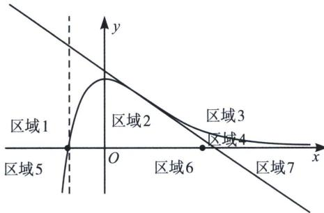

> [!faq]- 《导数专题(上)》例题解析
>
> > [!success]- **【答案】** AD
>
> > [!note]- **【分析】**
> > 本题未单列分析。
>
> > [!note]- **【解析】**
> > 解析 作曲线 $f(x)=\frac{x+1}{e^{x}}$ 的图像，并求得其拐点处 $\left(1,\frac{2}{e}\right)$ 切线方程为 $y=\frac{-x+3}{e}$ ，如图所示，点P(-1,t)位于虚线上，被曲线 $f(x)$ 和拐点处切线 $y=\frac{-x+3}{e}$ 分为三段，最上段位于区域3， $t>\frac{4}{e}$ ，此区间仅能作一条切线，对于 A, n=1，故 tn 可以等于 2022，A 正确；n=1 时，除了区域 3，还有区域 5，即 $f(x)$ 与 x 轴交点，故 $t \in \{0\} \cup \left(\frac{4}{e}, +\infty\right)$ ，D 正确；
> > 
> > 中间段 $0 < t < \frac{4}{e}$ 可以作三条切线，故B错误；
> > 最下段 t<0 时，不能作切线，此时 $te+n>3$ 不成立，故 C 错误；
> >
> > 故选 **AD**.
