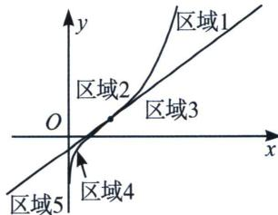

> [!faq]- 《导数专题(上)》例题解析
>
> > [!success]- **【答案】** AD
>
> > [!note]- **【分析】**
> > 本题未单列分析。
>
> > [!note]- **【解析】**
> > 解析 $f^{\prime}(x) = e^{x - 1} + \frac{1}{x}$ , 易知 $f^{\prime}(x) > 0$ , 故 $f(x)$ 在区间 $(0, +\infty)$ 单调递增, $f''(x) = e^{x - 1} - \frac{1}{x^2} = 0$ 时, $x = 1$ , 故 $(1, 1)$ 是函数 $f(x) = e^{x - 1} + \ln x$ 的唯一拐点, 在拐点处切线为 $y = 2x - 1$ , 由此切线和曲线将平面划分为几个区域, 如图, 我们发现渐近线是 $y$ 轴, 先看渐近线内侧, 易知区域 1 和区域 4 属于双外弧区域, 此区域内任意一点能作三条切线, 区域 2 和区域 3 属于拐点左右两侧的一内弧一外弧区域, 故其内任意点仅能作一条切线; 要过点 $(a, b)$ 恰能作曲线 $y = f(x)$ 的两条切线, 只能在函数 $f(x) = e^{x - 1} + \ln x$ 上除了拐点外上任意一点也能作两条切线, 拐点处切线上除了拐点外的任意一点也能作两条切线, 故 A 对 B 错; 我们再分析渐近线外侧, 区域 5 (比区域 4 少了一条 $y \to -\infty$ 的远切线), 故 C 错 D 对. 故选 AD.
> > 
> > 注意：这是一道综合发散型的多选，要求在各个角度维度来分析切线条数，所以我们对渐近线和拐点划分区域界定一定要精准掌握.
