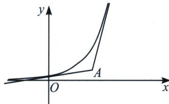

## 第二节 函数的切线界定

## 一、凹凸性与切线

我们可以参考圆的切线，对于圆上一点只能作一条切线，圆外一点能作两条切线，圆内一点不能作切线，所以对于一个凹凸性不改变的函数，即二阶导没有变号零点的函数，在“圆外”一点能作两条切线如下左图所示.

![[高中/总复习/专题/2026版高中《mst老唐说题》导数专题（数学）/上册/第02章_技能篇_导数的切线方程/第二节_函数的切线界定/例题/Q00046397.md]]
![[高中/总复习/专题/2026版高中《mst老唐说题》导数专题（数学）/上册/第02章_技能篇_导数的切线方程/第二节_函数的切线界定/例题/Q00046398.md]]
![[高中/总复习/专题/2026版高中《mst老唐说题》导数专题（数学）/上册/第02章_技能篇_导数的切线方程/第二节_函数的切线界定/例题/Q00046399.md]]
![[高中/总复习/专题/2026版高中《mst老唐说题》导数专题（数学）/上册/第02章_技能篇_导数的切线方程/第二节_函数的切线界定/例题/Q00046400.md]]
![[高中/总复习/专题/2026版高中《mst老唐说题》导数专题（数学）/上册/第02章_技能篇_导数的切线方程/第二节_函数的切线界定/例题/Q00046401.md]]
![[高中/总复习/专题/2026版高中《mst老唐说题》导数专题（数学）/上册/第02章_技能篇_导数的切线方程/第二节_函数的切线界定/对点训练/Q00046402.md]]
![[高中/总复习/专题/2026版高中《mst老唐说题》导数专题（数学）/上册/第02章_技能篇_导数的切线方程/第二节_函数的切线界定/例题/Q00046403.md]]
![[高中/总复习/专题/2026版高中《mst老唐说题》导数专题（数学）/上册/第02章_技能篇_导数的切线方程/第二节_函数的切线界定/例题/Q00046404.md]]
![[高中/总复习/专题/2026版高中《mst老唐说题》导数专题（数学）/上册/第02章_技能篇_导数的切线方程/第二节_函数的切线界定/例题/Q00046405.md]]
![[高中/总复习/专题/2026版高中《mst老唐说题》导数专题（数学）/上册/第02章_技能篇_导数的切线方程/第二节_函数的切线界定/例题/Q00046406.md]]
![[高中/总复习/专题/2026版高中《mst老唐说题》导数专题（数学）/上册/第02章_技能篇_导数的切线方程/第二节_函数的切线界定/例题/Q00046407.md]]
![[高中/总复习/专题/2026版高中《mst老唐说题》导数专题（数学）/上册/第02章_技能篇_导数的切线方程/第二节_函数的切线界定/例题/Q00046408.md]]
![[高中/总复习/专题/2026版高中《mst老唐说题》导数专题（数学）/上册/第02章_技能篇_导数的切线方程/第二节_函数的切线界定/例题/Q00046409.md]]
![[高中/总复习/专题/2026版高中《mst老唐说题》导数专题（数学）/上册/第02章_技能篇_导数的切线方程/第二节_函数的切线界定/例题/Q00046410.md]]
![[高中/总复习/专题/2026版高中《mst老唐说题》导数专题（数学）/上册/第02章_技能篇_导数的切线方程/第二节_函数的切线界定/例题/Q00046411.md]]
![[高中/总复习/专题/2026版高中《mst老唐说题》导数专题（数学）/上册/第02章_技能篇_导数的切线方程/第二节_函数的切线界定/例题/Q00046412.md]]
![[高中/总复习/专题/2026版高中《mst老唐说题》导数专题（数学）/上册/第02章_技能篇_导数的切线方程/第二节_函数的切线界定/例题/Q00046413.md]]
![[高中/总复习/专题/2026版高中《mst老唐说题》导数专题（数学）/上册/第02章_技能篇_导数的切线方程/第二节_函数的切线界定/例题/Q00046414.md]]
![[高中/总复习/专题/2026版高中《mst老唐说题》导数专题（数学）/上册/第02章_技能篇_导数的切线方程/第二节_函数的切线界定/例题/Q00046415.md]]
![[高中/总复习/专题/2026版高中《mst老唐说题》导数专题（数学）/上册/第02章_技能篇_导数的切线方程/第二节_函数的切线界定/例题/Q00046416.md]]
![[高中/总复习/专题/2026版高中《mst老唐说题》导数专题（数学）/上册/第02章_技能篇_导数的切线方程/第二节_函数的切线界定/例题/Q00046417.md]]
