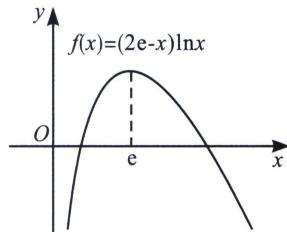
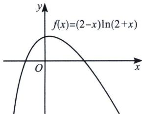
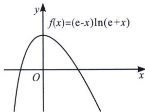
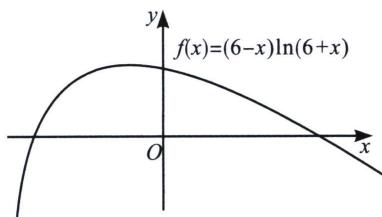

> [!faq]- 《导数专题(上册)》例题解析
>
> > [!success]- **【答案】** B
>
> > [!note]- **【解析】**
> > 解析 构造 $f(x)=(2e-x)\ln x$ . $\ln a=g(e-0.1)$ , $\ln b=g(e)=e$ , $\ln c=g(e+0.1)$ .
> >
> > $f'(x)=\frac{2e}{x}-1-\ln x$ 递减， $f'(e)=0$ 。所以 $f(x)\leqslant f(e)=e$ 。
> >
> > 
> >
> > 法一(微元法): 因为 0.1 非常小, 可以近似 $f'(e - 0.1) \approx \frac{e - \ln a}{0.1}$ , $f'(e + 0.1) \approx \frac{\ln c - e}{0.1}$ .
> >
> > $$
> > f ^ {\prime} (e - 0. 1) + f ^ {\prime} (e + 0. 1) = \frac {4 e ^ {2}}{(e - 0 . 1) (e + 0 . 1)} - 2 - \ln [ (e - 0. 1) (e + 0. 1) ] > \frac {4 e ^ {2}}{e ^ {2}} - 2 - \ln e ^ {2} = 0.
> > $$
> >
> > 所以 $\frac{e - \ln a}{0.1} +\frac{\ln c - e}{0.1} = \frac{\ln c - \ln a}{0.1} >0.$ 所以 $\ln b > \ln c > \ln a\Leftrightarrow b > c > a.$
> >
> > 法二(利用极值点偏移): $f''(x) = -\frac{2e}{x^2} - \frac{1}{x}$ , $f'''(x) = \frac{4e}{x^3} + \frac{1}{x^2} > 0$ , 极大值点左偏, 故 $\ln b > \ln c > \ln a \Leftrightarrow b > c > a$ , 故选 B.
> >
> > 注意: 小题判断极值点偏移, 源自三阶导, 参考对勾函数 $g(x) = x + \frac{1}{x}$ , 三阶导 $g''(x) = -\frac{6}{x^4} < 0$ , 根据图像性质我们可知第一象限极小值左偏, 第三象限极大值右偏, 在不清楚三阶导与极值点偏移关系的时候可以直接参考对勾函数, 本题易得极大值左偏.
> >
> > 通过这些题我们发现，若 $x_{0}$ 对于 a 为足够小，
> > - **①**：当 $a < e$ 时， $f(x) = (a - x)\ln (a + x)$ 在区间 $(-x_0, x_0)$ 单调递增，则有 $(a - x_0)^{a + x_0} < a^a < (a + x_0)^{a - x_0}$ ，如图，参考 $f(x) = (2 - x)\ln (2 + x)$ ，当 $x_0$ 足够小， $f(x)$ 在 $(-x_0, x_0)$ 单调递增；
> >
> > 
> >
> > 
> >
> > 
> > - **②**：当 a=e 时， $f(x)=(e-x)\ln(e+x)$ 在区间 $(-x_{0},0)$ 单调递增，在 $(0,x_{0})$ 单调递减，且极大值点左偏，则有 $(e-x_{0})^{e+x_{0}}<(e+x_{0})^{e-x_{0}}<e^{e}$ ，③当 a>e 时， $f(x)=(a-x)\ln(a+x)$ 在区间 $(-x_{0},x_{0})$ 单调递减，则有 $(a+x_{0})^{a-x_{0}}<a^{a}<(a-x_{0})^{a+x_{0}}$ ，如图，参考 $f(x)=(6-x)\ln(6+x)$ ，当 $x_{0}$ 足够小， $f(x)$ 在 $(-x_{0},x_{0})$ 单调递减；
