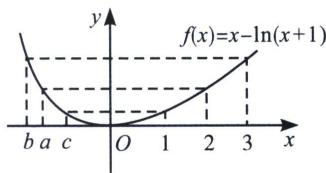

> [!faq]- 《导数专题(上册)》例题解析
>
> > [!success]- **【答案】** A
>
> > [!note]- **【解析】**
> > 解析 因为 a, b, c 均为负实数，由 $a=\ln\frac{a+1}{3}+2$ 可得 $a=2-\ln3+\ln(a+1)$ ，故 $a-\ln(a+1)=2-\ln3$ ，同理由 $b=\ln\frac{b+1}{4}+3$ 可得 $b-\ln(b+1)=3-\ln4$ ，因为 $c=2e^{c-1}-1$ ，所以 $c+1=2e^{c-1}$ ，所以 $\ln(c+1)=\ln2+c-1$ ，即 $c-\ln(c+1)=1-\ln2$ ，令 $f(x)=x-\ln(x+1)$ ，则 $f(a)=f(2)$ ， $f(b)=f(3)$ ， $f(c)=f(1)$ ，又 $f'(x)=1-\frac{1}{1+x}=\frac{x}{x+1}$ ，x>-1，易得，当 -1<x<0 时， $f'(x)<0$ ，函数单调递减，当 x>0 时， $f'(x)>0$ ，函数单调递增，所以 $f(1)<f(2)<f(3)$ ，又 a<0，b<0，c<0，所以 b<a<c。故选 A.
> >
> > 
