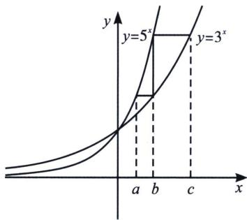

<!-- question-source:start -->
例38 (2023·四省联考)已知 a, b, c 满足 $a=\log_{5}(2^{b}+3^{b})$ ， $c=\log_{3}(5^{b}-2^{b})$ 则
A. $|a-c| \geqslant |b-c|$ , $|a-b| \geqslant |b-c|$ B. $|a-c| \geqslant |b-c|$ , $|a-b| \leqslant |b-c|$ C. $|a-c| \leqslant |b-c|$ , $|a-b| \geqslant |b-c|$ D. $|a-c| \leqslant |b-c|$ , $|a-b| \leqslant |b-c|$

<!-- question-source:end -->

![[高中/总复习/专题/2026版高中《mst老唐说题》导数专题（数学）/上册/第04章_小题篇_比大小/第一节_指数与对数比大小/五_直线与指数和差函数交点问题/例题/answers/Q00047185A1.md]]
