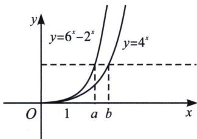
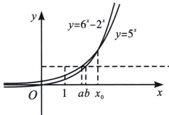

> [!faq]- 《导数专题(上册)》例题解析
>
> > [!success]- **【答案】** A
>
> > [!note]- **【分析】**
> > 本题未单列分析。
>
> > [!note]- **【解析】**
> > 解析 由 $4^{b} = 6^{a} - 2^{a}$ 得，作图 $y_{1} = 4^{x}$ 和 $y_{2} = 6^{x} - 2^{x}$ ，易知两图像交点为(1,4)，根据图像性质可知，当 $x > 1$ 时， $y_{2} > y_{1}$ ，故 $b > a > 1$ 或者 $1 > a > b$ ，排除 $B$ 和 $C$ ，故我们只能根据 $5^{a} = 6^{b} - 2^{b}$ 来判断，由于 $5^{1} > 6^{1} - 2^{1}$ ， $5^{2} < 6^{2} - 2^{2}$ ，故 $y_{2} = 6^{x} - 2^{x}$ 和 $y_{3} = 5^{x}$ 交点 $x_{0} \in (1,2)$ ，当 $x < x_{0}$ 时， $y_{3} > y_{2}$ ，当 $x > x_{0}$ 时， $y_{3} < y_{2}$ ，所以当 $x < 1$ 时，此时仅有 $1 > b > a$ 成立，与 D 选项矛盾，此时只有 A 正确，如图所示，当 $b > a > 1$ 符合题意；故选 A.
> > 
> > 
