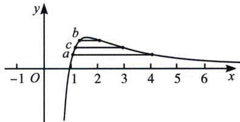

<!-- question-source:start -->
例27 (2024·沙河口区月考)已知 0<a<4, 0<b<2, 0<c<3，且 $16\ln a=a^{2}\ln4$ , $4\ln b=b^{2}\ln2$ , $9\ln c=c^{2}\ln3$ ，则
A. c>b>a B. c>a>b C. a>c>b D. b>c>a

(4)$ ， $f(b) = f
(2)$ ， $f(c) = f
(3)$ ，令 $g(x) = \frac{\ln x}{x}$ ，易得 $g(x)$ 在(0，e)单调递增，在 $(e, + \infty)$ 单调递减，由于 $f(x) = \frac{1}{2} g(x^{2})$ ，所以 $f(x)$ 在 $(0, \sqrt{e})$ 上单调递增，在 $(\sqrt{e},+\infty)$ 上单调递减，则 $f
(2) > f
(3) > f
(4)$ ，即 $f(b) > f(c) > f(a)$ ，所以 $\sqrt{e} >b > c >a >0$ ，故选D.例28若 $a\ln a > b\ln b > c\ln c = 1$ ，则 （）A. $e^{b + c}\ln a > e^{a + c}\ln b > e^{a + b}\ln c$ B. $e^{a + b}\ln c > e^{a + c}\ln b > e^{b + c}\ln a$ C. $e^{a + c}\ln b > e^{b + c}\ln a > e^{a + b}\ln c$ D. $e^{a + b}\ln c > e^{b + c}\ln a > e^{a + c}\ln b$
<!-- question-source:end -->

![[高中/总复习/专题/2026版高中《mst老唐说题》导数专题（数学）/上册/第04章_小题篇_比大小/第一节_指数与对数比大小/例题/answers/Q00046524A1.md]]
