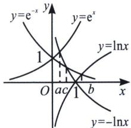

<!-- question-source:start -->
例30 (2023·小店区月考)若 $e^{a}=-\ln a,\ e^{-b}=\ln b,\ e^{-c}=-\ln c$ ，则

A. $a <   b <   c$ B. $a <   c <   b$ C. $b <   c <   a$ D. $b <   a <   c$
<!-- question-source:end -->

![[高中/总复习/专题/2026版高中《mst老唐说题》导数专题（数学）/上册/第04章_小题篇_比大小/第一节_指数与对数比大小/例题/answers/Q00046526A1.md]]
