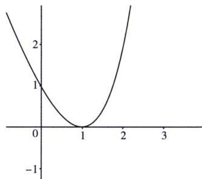

<!-- question-source:start -->
例32 (2025·黑龙江·一模)已知实数 $x, y, z$ 满足 $e^{x} - e^{2} = e(x - 2) \neq 0, e^{y} - e^{3} = e(y - 3) \neq 0, e^{z} - e^{5} = e(z - 5) \neq 0$ , 其中 $e$ 为自然对数的底数. 则 $x, y, z$ 的大小关系是 ( )
A. $x < y < z$ B. $y < x < z$ C. $z < x < y$ D. $z < y < x$

(1)=0$ ，若 t>1，则 $f'(t)>0$ ；若 t<1，则 $f'(t)<0$ ；
可得 $f(t)$ 在 $(1, +\infty)$ 上单调递增，在 $(-∞, 1)$ 上单调递减，如图：

又因为 $e^{x}-e^{2}=e(x-2)\neq0,\quad e^{y}-e^{3}=e(y-3)\neq0,\quad e^{z}-e^{5}=e(z-5)\neq0$ ，可得 $e^{x}-ex=e^{2}-2e,\quad e^{y}-ey=e^{3}-3e,\quad e^{z}-ez=e^{5}-5e$ ，即 $f(x)=f
(2),\quad f(y)=f
(3),\quad f(z)=f
(5)$ ，且 $x\neq2,\quad y\neq3,\quad z\neq5$ ，可知 $f(x)<f(y)<f(z)$ ，且 x<1，y<1，z<1，所以 z<y<x 。故选 D.
<!-- question-source:end -->

![[高中/总复习/专题/2026版高中《mst老唐说题》导数专题（数学）/上册/第04章_小题篇_比大小/第一节_指数与对数比大小/例题/answers/Q00046528A1.md]]
