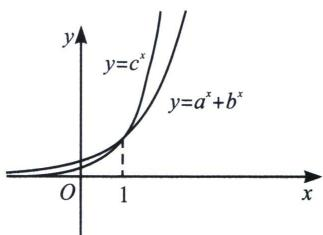
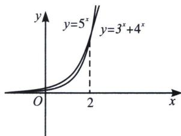
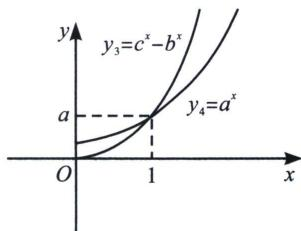

<!-- question-source:start -->
例35 (2024·衡水月考)已知正数 $a, b, c \in (1, +\infty)$ , 满足 $\frac{2a - 1}{a - 1} = 2 + \log_2 a, \frac{3b - 2}{b - 1} = 3 + \log_3 b,$ $\frac{4c - 3}{c - 1} = 4 + \log_4 c$ , 则下列不等式成立的是

第4章 小题篇——比大小 A. $c < b < a$ B. $a < b < c$ C. $a < c < b$ D. $c < a < b$

(1) 若 $a + b = c (c > b > a > 0)$ ，则 $y_{1} = a^{x} + b^{x}$ 与 $y_{2} = c^{x}$ 的图像均为增函数，且在 $(1, c)$ 处相交，当 x < 1 时， $y_{1} > y_{2}$ ，当 x > 1 时， $y_{1} < y_{2}$ （如图）；

(2) 若 $a^2 + b^2 = c^2 (c > b > a > 0)$ , 则 $y_1 = a^x + b^x$ 与 $y_2 = c^x$ 的图像均为增函数, 且在 $(2, c^2)$ 处相交, 当 $x < 2$ 时, $y_1 > y_2$ , 当 $x > 2$ 时, $y_1 < y_2$ (如图);

(3) 若 $a + b = c (c > b > a > 0)$ ，则 $y_{3} = c^{x} - b^{x}$ 与 $y_{4} = a^{x}$ 的图像均为增函数，且在 $(1, a)$ 处相交，当 x < 1 时， $y_{3} < y_{4}$ ，当 x > 1 时， $y_{3} > y_{4}$ （如图）；

关于两个函数开口差距大小，就是交点越高，开口越小，开口越低，开口越大.
<!-- question-source:end -->

![[高中/总复习/专题/2026版高中《mst老唐说题》导数专题（数学）/上册/第04章_小题篇_比大小/第一节_指数与对数比大小/例题/answers/Q00046531A1.md]]
