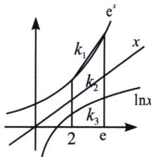

> [!faq]- 《导数专题(上)》例题解析
>
> > [!success]- **【答案】** D
>
> > [!note]- **【分析】**
> > 本题未单列分析。
>
> > [!note]- **【解析】**
> > 解析 $k_{1} > k_{2} > k_{3} \Leftrightarrow \frac{c}{a} > \frac{a}{a} > \frac{b}{a}$ . 所以 $c > a > b$ . 故选 D.
> > 
