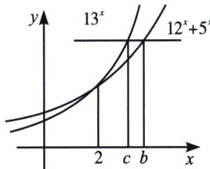

> [!faq]- 《导数专题(上)》例题解析
>
> > [!success]- **【答案】** C
>
> > [!note]- **【分析】**
> > 本题未单列分析。
>
> > [!note]- **【解析】**
> > 解析 $a < 2, b = \frac{\ln 3}{\ln 2} + \frac{2\ln 2}{\ln 2 + \ln 3} = \frac{\ln 3}{\ln 2} + \frac{2}{1 + \frac{\ln 3}{\ln 3}} = t + \frac{2}{1 + t} > 2.$ 针对B和C，作图 $y_{1} = 5^{x} + 12^{x}$ 与 $y_{2} = 13^{x}$ 的图像均为增函数，且在(2， $13^{2}$ )处相交，当 $x > 2$ 时， $y_{1} < y_{2}, 5^{b} + 12^{b} = 13^{c} = y_{0}$ ，则 $b > c$ 所以 $b > c > 2 > a$ 。故选C.
> > 
