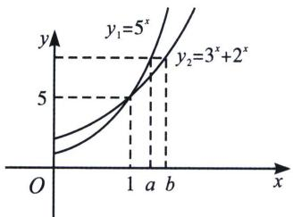
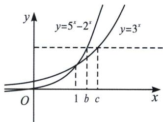
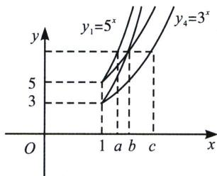

> [!faq]- 《导数专题(上)》例题解析
>
> > [!success]- **【答案】** B
>
> > [!note]- **【分析】**
> > 本题未单列分析。
>
> > [!note]- **【解析】**
> > 解析 法一：由 $2^{b} + 3^{b} = 5^{a}$ ， $3^{c} = 5^{b} - 2^{b}$ ，利用 $2^{2} + 3^{2} < 5^{2}$ ， $3^{2} < 5^{2} - 2^{2}$ 得： $c \geqslant b \geqslant a > 1$ ，所以 $|a - c| \geqslant |b - c|$ 针对单选，我们只考虑 $x > 1$ 情况，将两式相减消去 $2^{b}$ 得： $5^{a} - 5^{b} = 3^{b} - 3^{c}$ ，我们画图，作 $y = 5^{x}$ 与 $y = 3^{x}$ 得：由于 $y = 5^{x}$ 递增速率更快，所以 $|a - b| \leqslant |b - c|$ ，故选 B.
> > 法二：本题由于是单选，我们就单从 a>1, b>1, c>1 角度来考虑，由于 $y_{1}=5^{x}$ 与 $y_{2}=3^{x}+2^{x}$ 交于 (1, 5)，如左图所示，易得 $2^{b}+3^{b}=5^{a}$ 时，b>a>1； $y_{3}=5^{x}-2^{x}$ 与 $y_{4}=3^{x}$ 交于 (1, 3)，如中图所示，所以 c>b>1，且 $y_{2}$ 与 $y_{3}$ 相交于 $x_{0}\in(1,2)$ ，不妨令 $x_{0}=b$ ，如右图所示，交点越高的开口越小，交点越低的开口越大，所以 $|a - b|\leqslant |b - c|$ ，故选B.
> > 
> > 
> > 
