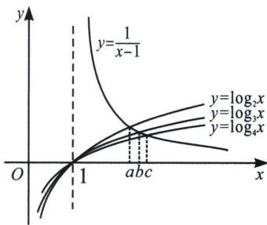

> [!faq]- 《导数专题(上册)》例题解析
>
> > [!success]- **【答案】** B
>
> > [!note]- **【分析】**
> > 本题未单列分析。
>
> > [!note]- **【解析】**
> > 解析 因为正数 $a, b, c \in (1, +\infty)$ ，满足 $\frac{2a - 1}{a - 1} = 2 + \log_2 a, \frac{3b - 2}{b - 1} = 3 + \log_3 b, \frac{4c - 3}{c - 1} = 4 + \log_4 c,$ 可得 $\frac{2a - 1}{a - 1} = 2 + \log_2 a \Rightarrow \frac{1}{a - 1} = \log_2 a, \frac{3b - 2}{b - 1} = 3 + \log_3 b \Rightarrow \frac{1}{b - 1} = \log_3 b, \frac{4c - 3}{c - 1} = 4 + \log_4 c \Rightarrow \frac{1}{c - 1} =$ $\log_4 c$ ，考虑 $y = \frac{1}{x - 1}$ 和 $y = \log_2 x, y = \log_3 x, y = \log_4 x$ 的图象的交点，可得 $a < b < c$ 。故选 B.
> > 
