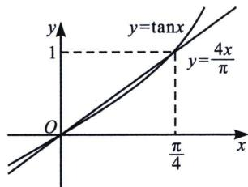
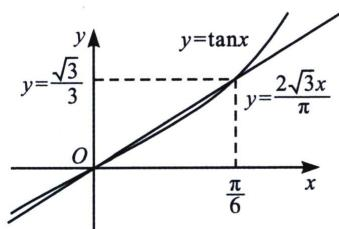

## 三、三角函数的切割线锁定

1. 我们知道 $\sin x < x$ ，但是下界没有锁定，我们可以利用原点和极值点 $\left(1, \frac{\pi}{2}\right)$ 的连线，形成割线放缩，即 $\sin x > \frac{2x}{\pi}$ ，同理，我们也能放大精度，利用原点和点 $\left(\frac{\pi}{6}, \frac{1}{2}\right)$ 的连线，形成割线放缩，即 $\sin x > \frac{3x}{\pi} \left(0 < x < \frac{\pi}{6}\right)$ ，同时，根据泰勒展开 $\sin x > \ln (1 + x)$ 对 $x \in (0, 1)$ 也成立，这个也是我们经常用到的。

2. 针对 $\tan x > x$ , $\tan x > x + \frac{1}{3}x^{3}$ ，似乎只有下界，那么针对其上界，我们进行割线处理，如左图，我们构造原点与 $\left(\frac{\pi}{4}, 1\right)$ 处的割线，则有 $\tan x < \frac{4x}{\pi} \left(0 < x < \frac{\pi}{4}\right)$ ，我们也可以提升精度，利用原点与 $\left(\frac{\pi}{6}, \frac{\sqrt{3}}{3}\right)$ 处的割线，则有 $\tan x < \frac{2\sqrt{3}x}{\pi} \left(0 < x < \frac{\pi}{6}\right)$ ;

![[高中/总复习/专题/2026版高中《mst老唐说题》导数专题（数学）/上册/第04章_小题篇_比大小/第二节_利用泰勒展开和帕德逼近比大小/三_三角函数的切割线锁定/例题/Q00047201.md]]
![[高中/总复习/专题/2026版高中《mst老唐说题》导数专题（数学）/上册/第04章_小题篇_比大小/第二节_利用泰勒展开和帕德逼近比大小/三_三角函数的切割线锁定/例题/Q00047202.md]]
