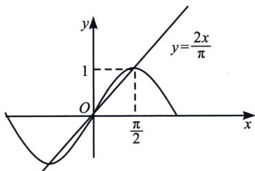
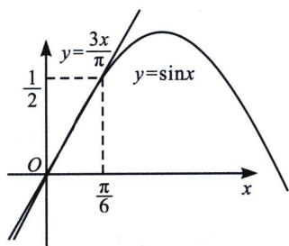

<!-- question-source:start -->
1. 我们知道 $\sin x < x$ ，但是下界没有锁定，我们可以利用原点和极值点 $\left(1, \frac{\pi}{2}\right)$ 的连线，形成割线放缩，即 $\sin x > \frac{2x}{\pi}$ ，同理，我们也能放大精度，利用原点和点 $\left(\frac{\pi}{6}, \frac{1}{2}\right)$ 的连线，形成割线放缩，即 $\sin x > \frac{3x}{\pi} \left(0 < x < \frac{\pi}{6}\right)$ ，同时，根据泰勒展开 $\sin x > \ln (1 + x)$ 对 $x \in (0, 1)$ 也成立，这个也是我们经常用到的。

<!-- question-source:end -->
