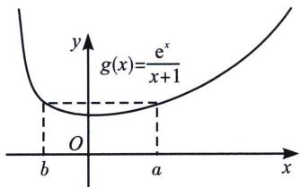
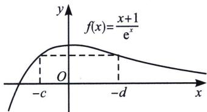

<!-- question-source:start -->
例23 (2023·日照一模·多选)已知 $a > b, c > d, \frac{e^a}{a + 1} = \frac{e^b}{b + 1} = 1.01, (1 - c)e^c = (1 - d)e^d = 0.99,$ 则有 A. $a + b > 0$ B. $c + d > 0$ C. $a + d > 0$ D. $b + c > 0$

<!-- question-source:end -->

![[高中/总复习/专题/2026版高中《mst老唐说题》导数专题（数学）/上册/第04章_小题篇_比大小/第二节_利用泰勒展开和帕德逼近比大小/例题/answers/Q00046557A1.md]]
