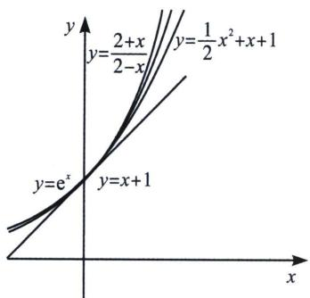
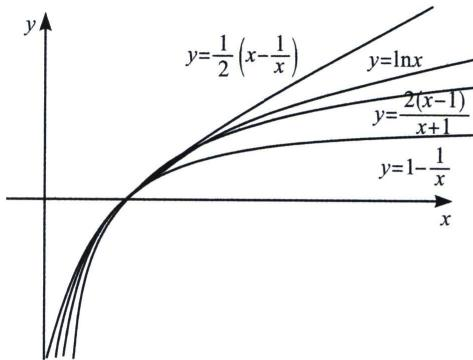

> [!faq]- 《导数专题(上)》例题解析
>
> > [!success]- **【答案】** B
>
> > [!note]- **【分析】**
> > 本题未单列分析。
>
> > [!note]- **【解析】**
> > 解析 已知 $b = 2\ln \left( \sin \frac{1}{8} + \cos \frac{1}{8} \right)$ 可得 $b = \ln \left( \sin \frac{1}{8} + \cos \frac{1}{8} \right)^2$ ，即 $b = \ln \left( 1 + \sin \frac{1}{4} \right)$ .
> > $$
> > c = \frac {5}{4} \ln \frac {5}{4}
> > $$
> > $$
> > c = \left(1 + \frac {1}{4}\right) \ln \left(1 + \frac {1}{4}\right)
> > $$
> > 由泰勒： $\ln(1+\sin x)<\sin x<x,\quad b=\ln\left(1+\sin\frac{1}{4}\right)<\sin\frac{1}{4}<\frac{1}{4},\quad b<a,\quad$ 由 x>0， $\ln(1+x)>1-\frac{1}{x+1}=\frac{x}{x+1}\Rightarrow(1+x)\ln(1+x)>x$ ，故 c>a；故选 B
> > ## 二、帕德逼近与飘带函数对上下界锁定
> > 我们通常做如下处理：
> > 当 $x \to 0^{+}$ 时， $\frac{2 + x}{2 - x} > e^{x} > \frac{1}{2} x^{2} + x + 1 > x + 1$ （左图）；
> > 当 $x \to 1^{+}$ 时， $\frac{1}{2} \left(x - \frac{1}{x}\right) > \ln x > \frac{2(x - 1)}{x + 1} > 1 - \frac{1}{x}$ (右图);
> > 
> > 
> > 这样，指数和对数的上下界都被锁定.
