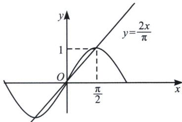

> [!faq]- 《导数专题(上)》例题解析
>
> > [!success]- **【答案】** B
>
> > [!note]- **【分析】**
> > 本题未单列分析。
>
> > [!note]- **【解析】**
> > 解析 根据泰勒展开， $e^{x}>x+1$ ， $(x>0)$ 。 $x>\sin x$ ， $(x>0)$ 。所以 $e^{0.1}>1+0.1>1+\sin0.1$ ，即 b>a；关于 a 和 c，我们尝试两种方法，第一种就是构造函数，第二种利用割线放缩，
> > 法一(构造函数)：令 $h(x)=\sin x-\frac{5}{8}x\left(0<x<\frac{\pi}{6}\right)$ ，则 $h'(x)=\cos x-\frac{5}{8}$ ，因为 $0<x<\frac{\pi}{6}$ ，所以 $\frac{\sqrt{3}}{2}<\cos x<1$ ，则 $\cos x>\frac{\sqrt{3}}{2}>\frac{5}{8}$ ，故 $h'(x)>0$ ，所以 $h(x)$ 在 $\left(0,\frac{\pi}{6}\right)$ 上单调递增，则 $h(x)>h(0)=0$ ，
> > 即 $\sin x > \frac{5}{8} x$ ，易知 $0.1 \in \left(0, \frac{\pi}{6}\right)$ ，所以 $\sin 0.1 > \frac{5}{8} \times 0.1 = \frac{1}{16}$ ，则 $1 + \sin 0.1 > 1 + \frac{1}{16} = \frac{17}{16}$ ，即 a>c；
> > 法二(割线放缩): 利用原点和极值点 $\left(\frac{\pi}{2},1\right)$ 的连线，形成割线放缩，即 $\sin x > \frac{2x}{\pi} > \frac{5}{8}x$ ，所以 $\sin 0.1 > \frac{5}{8} \times 0.1 = \frac{1}{16}$ ，则 $1 + \sin 0.1 > 1 + \frac{1}{16} = \frac{17}{16}$ ，即 a>c；综上：b>a>c。故选 B.
> > 
