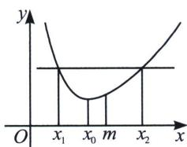
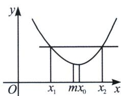
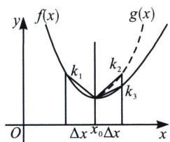

> [!faq]- 《导数专题(上)》例题解析
>
> > [!success]- **【答案】** A
>
> > [!note]- **【分析】**
> > 本题未单列分析。
>
> > [!note]- **【解析】**
> > 解析 令 $g(x)=e^{2x}-1-2(e^{x}-1)$ ，则 $g(0)=0$ ，当x>0， $g'(x)=2e^{2x}-2e^{x}>0$ ，所以 $g(x)$ 单调递增，所以 $g(x)>g(0)=0$ ，所以 $g\left(\frac{1}{4}\right)>0$ ，即b-a>0，同理，当x>0， $e^{x}>1+x$ ，又可得 $e^{x}>1+x+\frac{x^{2}}{2}$ ，所以 $a=2\left(e^{\frac{1}{4}}-1\right)>2\times\left(\frac{1}{4}+\frac{1}{32}\right)>0.55$ ，而 $\sin\frac{1}{4}+\tan\frac{1}{4}<\sin\frac{\pi}{12}+\tan\frac{\pi}{12}=\sin\left(\frac{\pi}{4}-\frac{\pi}{6}\right)+\tan\left(\frac{\pi}{4}-\frac{\pi}{6}\right)=\frac{\sqrt{2}}{2}\times\left(\frac{\sqrt{3}}{2}-\frac{1}{2}\right)+\frac{3-\sqrt{3}}{3+\sqrt{3}}=\frac{\sqrt{6}-\sqrt{2}}{4}+2-\sqrt{3}<0.53$ ，所以a>c。故选A.
> > ## 五、极值偏移与比大小
> > 一般结论：若 $f'''(x)<0\Leftrightarrow$ 极小值点左偏（极大值点右偏）； $f'''(x)>0\Leftrightarrow$ 极小值点右偏（极大值点左偏）证明：设 $m=\frac{x_{1}+x_{2}}{2}$ ， $f'(x_{0})=0$ 。由 taylor 公式得：
> > $$
> > f \left(x _ {1}\right) = f (m) + f ^ {\prime} (m) \left(x _ {1} - m\right) + \frac {f ^ {\prime \prime} (m)}{2} \left(x _ {1} - m\right) ^ {2} + \frac {f ^ {\prime \prime \prime} (\xi_ {1})}{6} \left(x _ {1} - m\right) ^ {3} \cdot \xi_ {1} \in \left(x _ {1}, m\right).
> > $$
> > $$
> > f \left(x _ {2}\right) = f (m) + f ^ {\prime} (m) \left(x _ {2} - m\right) + \frac {f ^ {\prime \prime} (m)}{2} \left(x _ {2} - m\right) ^ {2} + \frac {f ^ {\prime \prime \prime} \left(\xi_ {2}\right)}{6} \left(x _ {2} - m\right) ^ {3} \cdot \xi_ {2} \in (m, x _ {2}).
> > $$
> > 相械得： $f(x_{1})-f(x_{2})=f^{\prime}(m)(x_{1}-x_{2})+\frac{f^{\prime\prime\prime}(\xi_{1})+f^{\prime\prime\prime}(\xi_{2})}{6}\cdot\left(\frac{x_{1}-x_{2}}{2}\right)^{3}$ . 即 $f^{\prime}(m)=\frac{f(\xi_{1})+f^{\prime\prime\prime}(\xi_{2})}{6}\cdot\frac{(x_{1}-x_{2})^{2}}{8}$ .
> > 当 $f'''(x)<0$ 在 $(x_{1}, x_{2})$ 恒成立，所以 $f'(m)>0$ .
> > 若 $f'(x)$ 单调递增，所以 $x_0$ 为 $f(x)$ 的极小值点。 $f'(m) > f'(x_0)$ ，所以 $\frac{x_1 + x_2}{2} > x_0$ 。即极小值点左偏。若 $f'(x)$ 单调递减，所以 $x_0$ 为 $f(x)$ 的极大值点， $f'(m) < f'(x_0)$ ，所以 $\frac{x_1 + x_2}{2} < x_0$ ，即极大值点右偏。 $f'''(x) > 0$ 的情况同理可得。
> > 
> > 
> > 
> > 如图： $g(x)$ 是 $f(x)$ 关于 $x=x_{0}$ 的对称函数．则 $k_{1}+k_{2}=0$ ．若 $f(x)<g(x)$ 在 $(x_{0},x_{1})$ 恒成立，则必有 $k_{1}+k_{3}<0$ ．同理， $f(x)>g(x)$ 在 $(x_{0},x_{1})$ 恒成立，则有 $k_{3}+k_{1}>0$ 恒成立.
> > 从图像可以看出， $k_{2}$ 和 $k_{3}$ 的大小即是曲线弯曲程度。即比较 $g'(x_{0})$ 和 $f'(x_{0})$ 的大小。如果 $f'(x_{0})$ 和 $g'(x_{0})$ 相同，可以比较 $f^{(n)}(x_{0})$ 。直到可以比出大小。
