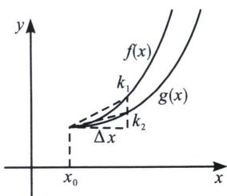

## 四、微元法与比大小

高考题中经常出现的一些比较小的变量，比如说 $\Delta x=0.1, \Delta x=0.01$ 的比大小问题，我们可以采用微元法，如图所示， $f(x)$ 和 $g(x)$ 图像如下，其中 $f(x_{0}+\Delta x)$ 与 $g(x_{0}+\Delta x)$ 的值可以用微元法来比较，当 $\Delta x\to0$ ，通常我们将 $\Delta x\leqslant0.1$ 时进行划分，利用导数的数值越大，则函数在自变量变化相同时，函数的变化率越大

从图像可以看出， $k_{1}$ 和 $k_{2}$ 的大小即是曲线弯曲程度。即比较 $f'(x_{0})$ 和 $g'(x_{0})$ 的大小。如果 $f'(x_{0})$ 和 $g'(x_{0})$ 相同，可以比较 $f^{(n)}(x_{0})$ 。直到可以比出大小。

![[高中/总复习/专题/2026版高中《mst老唐说题》导数专题（数学）/上册/第04章_小题篇_比大小/第二节_利用泰勒展开和帕德逼近比大小/四_微元法与比大小/例题/Q00047203.md]]
![[高中/总复习/专题/2026版高中《mst老唐说题》导数专题（数学）/上册/第04章_小题篇_比大小/第二节_利用泰勒展开和帕德逼近比大小/四_微元法与比大小/例题/Q00047204.md]]
![[高中/总复习/专题/2026版高中《mst老唐说题》导数专题（数学）/上册/第04章_小题篇_比大小/第二节_利用泰勒展开和帕德逼近比大小/四_微元法与比大小/例题/Q00047205.md]]
![[高中/总复习/专题/2026版高中《mst老唐说题》导数专题（数学）/上册/第04章_小题篇_比大小/第二节_利用泰勒展开和帕德逼近比大小/四_微元法与比大小/例题/Q00047206.md]]
