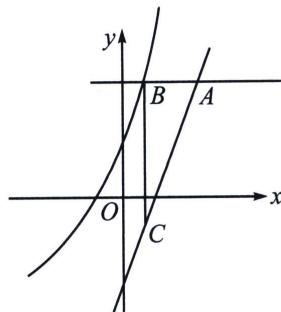

<!-- question-source:start -->
例6 (2023·无为市月考T12)已知直线 $y = a$ 分别与直线 $y = 2x - 2$ 和曲线 $y = 2e^{x} + x$ 相交于点 $A$ , $B$ , 点 $C$ 在直线 $y = 2x - 2$ 上, 且 $BC \perp AB$ , 则三角形 $ABC$ 的面积最小值为 ( ) A. $\frac{1}{2}(3 + \ln 2)^{2}$ B. $\frac{1}{4}(3 + \ln 2)^{2}$ C. $\frac{1}{8}(3 + \ln 2)^{2}$ D. $3 + 2\ln 2$

<!-- question-source:end -->

![[高中/总复习/专题/2026版高中《mst老唐说题》导数专题（数学）/上册/第05章_小题篇_数形结合/第一节_数形结合与恒成立/一_切线与距离问题/例题/answers/Q00047215A1.md]]
