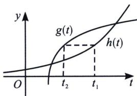
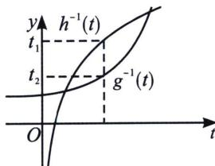

<!-- question-source:start -->
例7 (2023·湛江二模 T8)对于两个函数 $h(t)=e^{t-1}\left(t>\frac{1}{2}\right)$ 与 $g(t)=\ln(2t-1)+2\left(t>\frac{1}{2}\right)$ ，若这两个函数值相等时对应的自变量分别为 $t_{1}$ ， $t_{2}$ ，则 $t_{2}-t_{1}$ 的最小值为（）
A. -1 B. $-\ln2$ C. $1-\ln3$ D. $1-2\ln2$

(2) = -\ln 2$ ，即 $t_2 - t_1$ 的最小值为 $-\ln 2$ ，故选B.
<!-- question-source:end -->

![[高中/总复习/专题/2026版高中《mst老唐说题》导数专题（数学）/上册/第05章_小题篇_数形结合/第一节_数形结合与恒成立/二_反函数构造水平距离差问题/例题/answers/Q00047216A1.md]]
