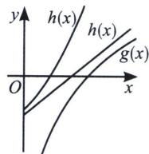
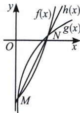

> [!faq]- 《导数专题(上册)》例题解析
>
> > [!success]- **【答案】** B
>
> > [!note]- **【分析】**
> > 本题未单列分析。
>
> > [!note]- **【解析】**
> > 解析 设 $f(x)=e^{x}-c$ ， $g(x)=\ln x$ ， $h(x)=ax+b$ ，由 $(e^{x}-ax-b-c)(ax+b-\ln x)\geqslant0$
> > $$
> > [ f (x) - h (x) ] [ h (x) - g (x) ] \geqslant 0
> > $$
> > $$
> > x > 0
> > $$
> > $$
> > f (x) \geqslant h (x) \geqslant g (x)
> > $$
> > $$
> > f (x) \leqslant h (x) \leqslant g (x)
> > $$
> > A 和 B 选项：当 c<2 时， $f(x)-g(x)=e^{x}-x-1+x-\ln x-1+2-c>0$ ，即 $\forall x>0,\ f(x)\geqslant h(x)\geqslant g(x)$ .
> > 
> > 
> > 设 $s(x)=h(x)-g(x)=ax+b-\ln x$ ，由题意可知 $s(x)\geqslant0,\quad a>0,\quad s'(x)=a-\frac{1}{x}$ ，当 $x\in\left(0,\frac{1}{a}\right)$ 时， $s'(x)<0,\quad s(x)$ 在 $\left(0,\frac{1}{a}\right)$ 上单调递减，当 $x\in\left(\frac{1}{a},+\infty\right)$ 时， $s'(x)>0,\quad s(x)$ 在 $\left(\frac{1}{a},+\infty\right)$ 单调递增，所以 $s(x)\geqslant s\left(\frac{1}{a}\right)=1+b+\ln a\geqslant0$ ，得 $a\geqslant e^{-b-1}$ ，由 $s
