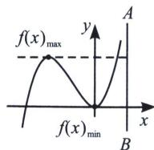
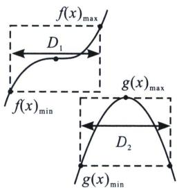
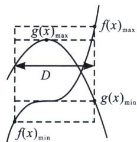
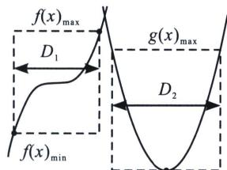

> [!faq]- 《导数专题(上)》例题解析
>
> > [!success]- **【答案】** B
>
> > [!note]- **【分析】**
> > 本题未单列分析。
>
> > [!note]- **【解析】**
> > 解析 设 $f(x)=e^{2x}$ 的反函数为 $y=\frac{\ln x}{2}$ ， $g(x)=\ln x+\frac{1}{2}$ 的反函数为 $f(x)=e^{x-\frac{1}{2}}$ 分别与直线x=a交于点 $A'$ ， $B'$ ， $|AB|=|A'B'|$ ，故 $|AB|=e^{a-\frac{1}{2}}-\frac{\ln a}{2}$ ，令 $f(x)=e^{x-\frac{1}{2}}-\frac{\ln x}{2}$ ， $f'(x)=e^{x-\frac{1}{2}}-\frac{1}{2x}=0$ $\Rightarrow x=\frac{1}{2}$ ，显然 $f(x)_{\min}=f\left(\frac{1}{2}\right)=1+\frac{\ln 2}{2}$ ，故选B.
> > ## 三、不同函数包裹性解决恒成立能成立问题
> > 定理一若 $y = f(x)$ 满足 $\forall x_1, x_2 \in D, |f(x_1) - f(x_2)| < m$ 恒成立，则在区间 $D$ 上 $f(x)_{\max} - f(x)_{\min} < m$
> > 如左图所示，令 AB=m，则 $\left|f(x_{1})-f(x_{2})\right|<m$ 恒成立.
> > 
> > 
> > 定理二若 $y=f(x)$ ， $y=g(x)$ 满足 $\forall x_{1}\in D_{1}$ ， $x_{2}\in D_{2}$ ， $f(x_{1})>g(x_{2})$ 恒成立，则在各自区间上 $f(x)_{\min}>g(x)_{\max}$ ；如上右图所示， $f(x)$ 的区域始终在 $g(x)$ 区域上方才满足条件.
> > 
> > 
> > $g(x)_{\mathrm{min}}$
> > 定理三(包裹性定理)若 $y=f(x)$ ， $y=g(x)$ 满足若 $\forall x_{1}\in D$ ，总 $\exists x_{0}\in D$ ，使得 $f(x_{0})=g(x_{1})$ 成立，则在区间 D 上 $\left\{\begin{aligned}f(x)_{\min}<g(x)_{\min}\\ f(x)_{\max}>g(x)_{\max}\end{aligned}\right.$ ；如左图， $y=f(x)$ 所在区域能包含 $y=g(x)$ 所在区域时，满足条件.
> > 定理四若 $y = f(x)$ ， $y = g(x)$ 满足 $\forall x_1 \in D_1$ ，总 $\exists x_2 \in D_2$ 使得 $f(x_1) > g(x_2)$ 能成立，则在区间 $D$ 上 $f(x)_{\min} > g(x)_{\min}$ ；如右图， $y = f(x)$ 所在区域最小值大于 $y = g(x)$ 所在区域最小值时，满足条件.
> > 注意包裹性定理的关键在于区别符号 $\forall$ 与 $\exists$ ，还要看是否有两个区间与 $x_{1} \in D_{1}$ ， $x_{2} \in D_{2}$ .
