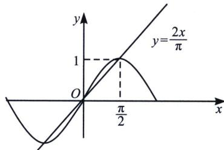

> [!faq]- 《导数专题(上册)》例题解析
>
> > [!success]- **【答案】** D
>
> > [!note]- **【分析】**
> > 本题未单列分析。
>
> > [!note]- **【解析】**
> > 解析 法一：由已知有 $x > 0$ ，对原不等式同时除以 $x$ ，可得： $a < \frac{\sin x}{x} < b$ ，构造函数 $f(x) = \frac{\sin x}{x}$ 即要求 $b - a$ 的最小值即是求解 $f(x)$ 在 $x \in \left(0, \frac{\pi}{2}\right)$ 的最大值与最小值即可， $f'(x) = \frac{\cos x \cdot x - \sin x}{x^2}$ ，令 $h(x) = \cos x \cdot x - \sin x$ ， $h'(x) = -x \cdot \sin x$ ，因为 $x \in \left(0, \frac{\pi}{2}\right)$ ，故 $h'(x) < 0$ 恒成立，故 $h(x)$ 在 $\left(0, \frac{\pi}{2}\right)$ 单调递减，又因为 $h(0) = 0$ ，故 $h(x) < h(0) = 0$ ，即 $f'(x) < 0$ 在 $\left(0, \frac{\pi}{2}\right)$ 恒成立，故 $f(x)$ 在 $\left(0, \frac{\pi}{2}\right)$ 单调递减，且 $x \to 0$ 时， $\frac{\sin x}{x} \to 1$ ，当 $x = \frac{\pi}{2}$ 时， $f(x) = \frac{2}{\pi}$ ，故 $b - a$ 的最小值为 $1 - \frac{2}{\pi}$ ，法二（切割线构造）：本方法已经在上一章比大小中介绍，我们知道 $\sin x < x$ ，但是下界没有锁定，我们可以利用原点和极值点 $\left(1, \frac{\pi}{2}\right)$ 的连线，形成割线放缩，即 $\sin x > \frac{2x}{\pi} \left(0 < x < \frac{\pi}{2}\right)$ ，故 $b - a$ 的最小值为 $1 - \frac{2}{\pi}$ ，故选 D.
> > 
