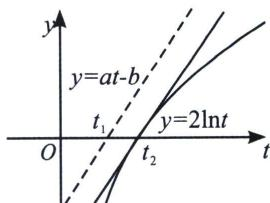

> [!faq]- 《导数专题(上册)》例题解析
>
> > [!success]- **【答案】** B
>
> > [!note]- **【解析】**
> > 解析 法一(切线找点): $ae^{x} \geqslant 2x + b \Rightarrow e^{x + \ln a - \ln 2} \geqslant x + \ln a - \ln 2 + 1 \geqslant x + \frac{b}{2} \Rightarrow b \leqslant 2\ln \frac{a}{2} + 2, \frac{b}{a} \leqslant$
> >
> > $\left(2\frac{\ln\frac{a}{2}+1}{a}\right)_{\max}=\left(e\cdot\frac{\ln\frac{ea}{2}}{\frac{ea}{2}}\right)_{\max}=1,\ b=a=2$ 时取等，即 $\frac{b}{a}$ 的最大值是 1.
> >
> > 
> >
> > 法二(零点比大小): $ae^{x} \geqslant 2x + b \Rightarrow ae^{x} - b \geqslant 2x$ , 令 $e^{x} = t$ , 则 $at - b \geqslant 2\ln t$ , 如图当 $y = at - b$ 一直在一个上凸函数 $y = 2\ln t$ 上方时, 则横截距 $t_{1} = \frac{b}{a}$ 一定在 $t_{2} = 1$ 左边, 即 $\frac{b}{a} \leqslant 1$ .
> >
> > 故选 **B**.
