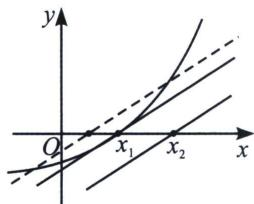
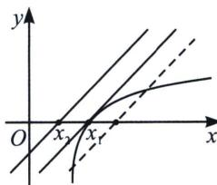

## 考点 4：双参数比值利用零点比大小

① $kx+b\leqslant f(x)$ 恒成立，求 $\frac{b}{k}$ 的最值和取值范围；② $kx+b\geqslant f(x)$ 恒成立，求 $\frac{b}{k}$ 的最值和取值范围；

如图所示，通常 $y=f(x)$ 是一个凹函数 $(f''(x)>0)$ ， $kx+b\leqslant f(x)$ 意味着 $y=f(x)$ 与 $y=kx+b$ 相切时即恒成立， $\left(-\frac{b}{k},0\right)$ 是直线和 x 轴的交点，记为 $(x_{2},0)$ ，故此类型题可以将 $y=f(x)$ 的唯一零点 $x_{1}$ 求出，满足 $x_{1}\leqslant x_{2}=-\frac{b}{k}$ 即可。同理，在比较 $kx+b\geqslant f(x)$ 时，此时 $y=f(x)$ 为凸函数 $(f''(x)<0)$ ，构造 $x_{1}\geqslant x_{2}=-\frac{b}{k}$ ；四个图中的虚线直线是不可能满足题目要求的，此类方法叫做零点切线探路，或者叫零点比大小。

![[高中/总复习/专题/2026版高中《mst老唐说题》导数专题（数学）/上册/第05章_小题篇_数形结合/第一节_数形结合与恒成立/考点_4_双参数比值利用零点比大小/例题/Q00047228.md]]
![[高中/总复习/专题/2026版高中《mst老唐说题》导数专题（数学）/上册/第05章_小题篇_数形结合/第一节_数形结合与恒成立/考点_4_双参数比值利用零点比大小/例题/Q00047229.md]]
![[高中/总复习/专题/2026版高中《mst老唐说题》导数专题（数学）/上册/第05章_小题篇_数形结合/第一节_数形结合与恒成立/考点_4_双参数比值利用零点比大小/例题/Q00047230.md]]
![[高中/总复习/专题/2026版高中《mst老唐说题》导数专题（数学）/上册/第05章_小题篇_数形结合/第一节_数形结合与恒成立/考点_4_双参数比值利用零点比大小/例题/Q00047231.md]]
![[高中/总复习/专题/2026版高中《mst老唐说题》导数专题（数学）/上册/第05章_小题篇_数形结合/第一节_数形结合与恒成立/考点_4_双参数比值利用零点比大小/例题/Q00047232.md]]
![[高中/总复习/专题/2026版高中《mst老唐说题》导数专题（数学）/上册/第05章_小题篇_数形结合/第一节_数形结合与恒成立/考点_4_双参数比值利用零点比大小/例题/Q00047233.md]]
