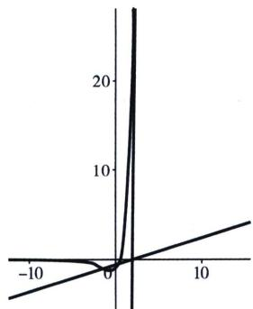

> [!faq]- 《导数专题(上)》例题解析
>
> > [!success]- **【答案】** C
>
> > [!note]- **【分析】**
> > 本题未单列分析。
>
> > [!note]- **【解析】**
> > 解析 $\mathrm{e}^{x}(2x-1)-ax+2a<0\Leftrightarrow\mathrm{e}^{x}(2x-1)<ax-2a$ 有唯一整数点，y=ax-2a 单调递减，恒过(2,0)，若 $a\leqslant0,\quad x<0$ 时必有无数个整数点，不满足；
> > 先分析右边图像，令 $h(x)=\mathrm{e}^{x}(2x-1)$ ， $h'(x)=\mathrm{e}^{x}(2x+1)$ ，x>2， $h'(x)>\frac{1}{2}$ ，不可能有整数点，再分析左边图像，若有整数点， $h(0)=-1-2a>-1$ ， $h(-1)=-3\mathrm{e}^{-1}\geqslant-a-2a\Rightarrow\frac{1}{\mathrm{e}}\leqslant a<\frac{1}{2}$ ，故选 C.
> > 
