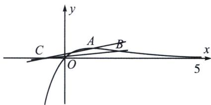

<!-- question-source:start -->
例5 (2024·西安模拟)已知函数 $f(x) = a(x + 1)\mathrm{e}^x - x$ ，若存在唯一的正整数 $x_0$ ，使得 $f(x_0) < 0$ ，则实数 $a$ 的取值范围是（）A. $\left[-\frac{1}{2\mathrm{e}}, \frac{3}{4\mathrm{e}^3}\right)$ B. $\left[\frac{3}{4\mathrm{e}^3}, \frac{2}{3\mathrm{e}^2}\right)$ C. $\left[\frac{2}{3\mathrm{e}^2}, \frac{1}{2\mathrm{e}}\right)$ D. $\left[\frac{1}{2\mathrm{e}}, \frac{1}{2}\right)$

(1) = \frac{1}{\mathrm{e}}$ ， $h(x) = a(x + 1)$ 过定点 $C(-1, 0)$ ，当 $a \leqslant 0$ 时，有无穷多个 $x$ 的值使得 $h(x) < g(x)$ ，当 $a > 0$ 时，函数 $h(x)$ 单调递增，由图象可以分析得到只有正整数 $x = 1$ 使得 $h(x) < g(x)$ ，令 $A\left(1, \frac{1}{\mathrm{e}}\right)$ ， $B\left(2, \frac{2}{\mathrm{e}^2}\right)$ ，则 $k_{AC} = \frac{\frac{1}{\mathrm{e}}}{1 - (-1)} = \frac{1}{2\mathrm{e}}$ ， $k_{BC} = \frac{\frac{2}{\mathrm{e}^2}}{2 - (-1)} = \frac{2}{3\mathrm{e}^2}$ ，由图可知，实数 $a$ 的取值范围为 $\frac{2}{3\mathrm{e}^2} \leqslant a < \frac{1}{2\mathrm{e}}$ . 故选 C.

<!-- question-source:end -->

![[高中/总复习/专题/2026版高中《mst老唐说题》导数专题（数学）/上册/第05章_小题篇_数形结合/第三节_整点问题/考点1_整点问题_直曲分离与数形结合/例题/answers/Q00047282A1.md]]
