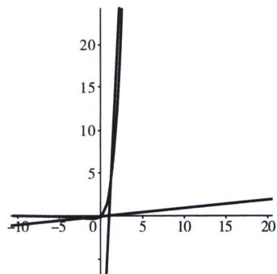

> [!faq]- 《导数专题(上册)》例题解析
>
> > [!success]- **【答案】** B
>
> > [!note]- **【分析】**
> > 本题未单列分析。
>
> > [!note]- **【解析】**
> > 解析 $x\mathrm{e}^{x} - ax + a < 0 \Leftrightarrow x\mathrm{e}^{x} < ax - a$ 有唯一整数点， $y = ax - a$ 恒过(1, 0)
> > 若 $a \leqslant 0$ ，由同构函数 $y = x \mathrm{e}^{x}$ 图像如图， $x < 0$ ， $x \mathrm{e}^{x} < ax - a$ 恒成立，则必有无数个整数点，不满足；故 $a > 0$ ，先分析右边图像，若在右边有整数点，则由 $x \mathrm{e}^{x}$ 增长的越来越快，只能是 $x = 2$ 成立， $x = 3$ 不成立，由图像知：即 $\left\{ \begin{array}{l} 2 \mathrm{e}^{2} < 2a - a \\ 3 \mathrm{e}^{3} \geqslant 3a - a \end{array} \right. \Rightarrow 2 \mathrm{e}^{2} < a \leqslant \frac{3}{2} \mathrm{e}^{3}$ ，再分析左边图像，若在左边有整数点，只可能在 $x = -1$ 成立， $x = -2$ 不成立， $\left\{ \begin{array}{l} -\mathrm{e}^{-1} < -a - a \\ -2\mathrm{e}^{-2} \geqslant -2a - a \end{array} \right. \Rightarrow \frac{2}{3\mathrm{e}^{2}} \leqslant a < \frac{1}{2\mathrm{e}}$ ，故选B.
> > 
