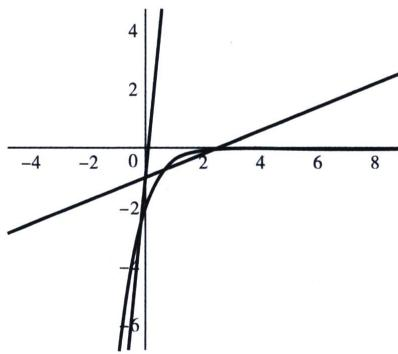

> [!faq]- 《导数专题(上册)》例题解析
>
> > [!success]- **【答案】** C
>
> > [!note]- **【分析】**
> > 本题未单列分析。
>
> > [!note]- **【解析】**
> > 解析 $e^{x}(ax-1)-x+2<0$ 有唯一整点，即 $ax-1<\frac{x-2}{e^{x}}$ 有唯一整数点，y=ax-1 恒过 $(0,-1)$ ， $h(x)=\frac{x-2}{e^{x}}, h'(x)=\frac{3-x}{e^{x}}$ ，先分析右边：由函数凹凸性和单调性， $\left\{\begin{aligned}&a-1<\frac{1-2}{e^{1}}\\&2a-1\geqslant0\end{aligned}\right.\Rightarrow\frac{1}{2}\leqslant a<1-\frac{1}{e}$ 再分析左边：只能 $\left\{\begin{aligned}-a-1<\frac{-1-2}{e^{-1}}\\-2a-1\geqslant\frac{-2-2}{e^{-2}}\end{aligned}\right.\Rightarrow3e-1<a\leqslant2e^{2}-\frac{1}{2}$ ，故选C.
> > 
