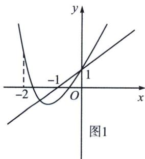
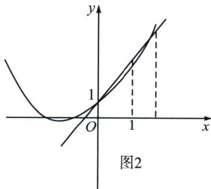

> [!faq]- 《导数专题(上册)》例题解析
>
> > [!success]- **【答案】** D
>
> > [!note]- **【解析】**
> > 解析 解: 函数 $f(x)=2x+1-(ax+1)\mathrm{e}^{x}$ , 其中 $a>0$ , 设 $g(x)=\mathrm{e}^{x}(ax+1)$ , $y=h(x)=2x+1$ , $g(0)=h(0)=1$ . 因为存在唯一的整数 $x_{0}$ , 使得 $f(x_{0})>0$ , 所以存在唯一的整数 $x_{0}$ , 使得 $g(x_{0})$ 在 $y=2x+1$ 的下方, 因为 $g^{\prime}(x)=(ax+1+a)\mathrm{e}^{x}=a\left(x+\frac{a+1}{a}\right)\mathrm{e}^{x}$ , 所以当 $x<-\frac{a+1}{a}$ 时, $g^{\prime}(x)<0$ , 当$x > -\frac{a+1}{a}$ 时， $g'(x) > 0$ ，所以当 $x = -\frac{a+1}{a} = -1 - \frac{1}{a}$ 时， $\left[g(x)\right]_{\min} = g\left(-\frac{a+1}{a}\right) = -ae^{-\frac{a+1}{a}}$ .
> > - **①**：如图1所示，要求： $\begin{cases}g(-1) < h(-1) \\ g(-2) \geqslant h(-2)\end{cases}$ ，即 $\begin{cases}(1-a)e^{-1} < -1 \\ e^{-2}(1-2a) \geqslant -3\end{cases}$ ，解得： $1 + e < a \leqslant \frac{1 + 3e^2}{2}$ .
> > - **②**：如图2所示，要求： $\begin{cases}g(1) < h(1) \\ g(2) \geqslant h(2)\end{cases}$ ，即 $\begin{cases}e(a+1) < 3 \\ e^2(2a+1) \geqslant 5\end{cases}$ ，及其 $a > 0$ ，解得 $0 < a < \frac{3}{e} - 1$ .
> >
> > 综上可得：实数 $a$ 的取值范围为： $\left(0, \frac{3}{e} - 1\right) \cup \left(1 + e, \frac{1 + 3e^2}{2}\right]$ . 故选D.
> >
> > 
> >
> > 
