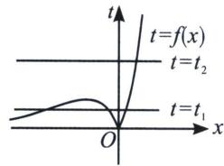
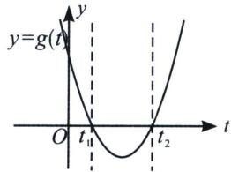

<!-- question-source:start -->
例13 (2023·福州期末 T16)已知 $f(x)=|xe^{x}|$ ，关于 x 的方程 $f^{2}(x)+af(x)+2=0(a\in\mathbf{R})$ 有四个不同的实数根，则 a 的取值范围为 \_\_\_\_.

<!-- question-source:end -->

![[高中/总复习/专题/2026版高中《mst老唐说题》导数专题（数学）/上册/第05章_小题篇_数形结合/第二节_数形结合与零点问题/例题/answers/Q00046616A1.md]]
