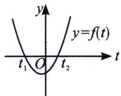
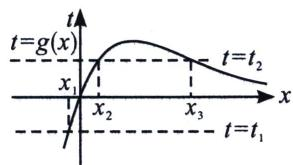

<!-- question-source:start -->
例17 (2020·四川攀枝花期末 T12)已知函数 $f(x)=\left(\frac{x}{e^{x}}\right)^{2}+\frac{ax}{e^{x}}-a$ 有三个不同的零点 $x_{1}, x_{2}, x_{3}$ (其中 $x_{1}<x_{2}<x_{3}$ )，则 $\left(1-\frac{x_{1}}{e^{x_{1}}}\right)^{2}\left(1-\frac{x_{2}}{e^{x_{2}}}\right)\left(1-\frac{x_{3}}{e^{x_{3}}}\right)$ 的值为
A. 1 B. -1 C. a D. -a

(1) = \frac{1}{e}$ ，如图左，由题意得 $g(t) = t^2 + at - a$ 必有两个根 $t_1 < 0$ ，且 $0 < t_2 < \frac{1}{e}$ ，由根与系数的关系有， $t_1 + t_2 = -a$ ， $t_1 t_2 = -a$ ，由图右可知， $t_1 = \frac{x}{e^x}$ 有一解 $x_1 < 0$ ， $t_2 = \frac{x}{e^x}$ 有两解 $x_2$ ， $x_3$ ，且 $0 < x_2 < 1 < x_3$ ， $\left(1 - \frac{x_2}{e^{x_2}}\right)\left(1 - \frac{x_3}{e^{x_3}}\right) = (1 - t_1)^2 (1 - t_2)(1 - t_2) = [(1 - t_1)(1 - t_2)]^2 = [1 - (t_1 + t_2) + t_1 t_2]^2 = (1 + a - a)^2 = 1$ ，故选 A.

<!-- question-source:end -->

![[高中/总复习/专题/2026版高中《mst老唐说题》导数专题（数学）/上册/第05章_小题篇_数形结合/第二节_数形结合与零点问题/例题/answers/Q00046619A1.md]]
