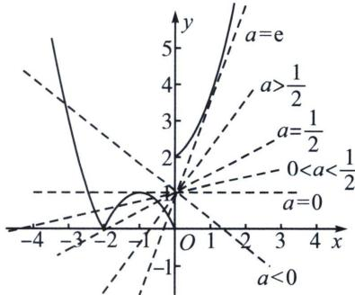

> [!faq]- 《导数专题(上)》例题解析
>
> > [!success]- **【答案】** D
>
> > [!note]- **【分析】**
> > 本题未单列分析。
>
> > [!note]- **【解析】**
> > 解析 函数 $g(x)=f(x)-ax-1$ 有三个零点，等价于函数 $f(x)$ 与 $y=ax+1$ 图象有3个交点，且 $y=ax+1$ 图象恒过点(0,1)，作出函数 $f(x)$ 的图象如图：
> > 
> > 如图，当 a<0 时， $y=ax+1$ 与 $f(x)$ 的图象有且只有一个交点，当 a=0 时， $y=ax+1$ 与 $f(x)$ 的图象有 2 个交点，当 $0<a<\frac{1}{2}$ 时， $y=ax+1$ 与 $f(x)$ 的图象有 3 个交点，易得，当 a=e 时， $y=ex+1$ 是 $y=e^{x}+1$ 的切线，此时 $y=ax+1$ 与 $f(x)$ 的图象有 2 个交点，由图，当 a>e 时， $y=ax+1$ 与 $f(x)$ 的图象有 3 个交点，当 $\frac{1}{2}<a<e$ 时， $y=ax+1$ 与 $f(x)$ 的图象有 1 个交点，综上， $a\in(0,\frac{1}{2})\cup(e,+\infty)$ ，
> >
> > 故选 **D**.
