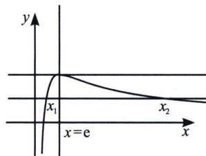

> [!faq]- 《导数专题(上)》例题解析
>
> > [!success]- **【答案】** 详见解析
>
> > [!note]- **【分析】**
> > 本题未单列分析。
>
> > [!note]- **【解析】**
> > 解析 方程 $2e^{2}\ln^{2}x - 3ex\ln x + x^{2} = 0$ ，等价为 $2e^{2} \cdot \frac{\ln^{2}x}{x^{2}} - 3e \cdot \frac{\ln x}{x} + 1 = 0$ ，令 $t = \frac{\ln x}{x}$ ，则方程等价为 $2e^{2}t^{2} - 3et + 1 = 0$ ，即 $(et - 1)(2et - 1) = 0$ ，得 $t = \frac{1}{e}$ 或 $t = \frac{1}{2e}$ ，设 $f(x) = \frac{\ln x}{x}$ ， $(x > 0)$ ， $f'(x) = \frac{1 - \ln x}{x^2}$ ，由 $f'(x) > 0$ 得 $\ln x < 1$ ，即 $0 < x < e$ ，此时 $f(x)$ 为增函数，由 $f'(x) < 0$ 得 $\ln x > 1$ ，即 $x > e$ ，此时 $f(x)$ 为减函数，即当 $x = e$ 时， $f(x)$ 取得极大值 $f(e) = \frac{1}{e}$ ，作出 $f(x)$ 的图象如图：
> > 
> > 则 $f
