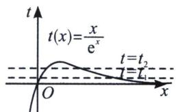

> [!faq]- 《导数专题(上)》例题解析
>
> > [!success]- **【答案】** BCD
>
> > [!note]- **【分析】**
> > 本题未单列分析。
>
> > [!note]- **【解析】**
> > 解析 由题意知 $\frac{x^2}{e^x} + e^{x - 4} - ax = 0$ 有四个不同的根，显然 $x \neq 0$ ，则 $\frac{x}{e^x} + \frac{e^x}{e^4 x} - a = 0$ ，令 $t = \frac{x}{e^x}$ ，则 $t + \frac{1}{e^4 t} - a = 0$ ，即 $e^4 t^2 - e^4 at + 1 = 0$ ， $t = \frac{x}{e^x}$ 的大致图像如图所示：
> > 
> > 根据题意知 $e^{4}t^{2}-e^{4}at+1=0$ 存在两根 $t_{1}$ ， $t_{2}$ ，不妨设 $t_{1}<t_{2}$ ，则满足 $0<t_{1}<t_{2}<\frac{1}{e}$ ， $t_{1}t_{2}=\frac{1}{e^{4}}$ ，即有 $t_{1}=\frac{x_{1}}{e^{x_{1}}}=\frac{x_{4}}{e^{x_{4}}}$ ， $t_{2}=\frac{x_{2}}{e^{x_{2}}}=\frac{x_{3}}{e^{x_{3}}}$ ，则由图象可知 $0<x_{1}<x_{2}<1$ ，所以 $x_{1}+x_{2}<2$ ，故 A 错误；
> > 由于方程 $e^4 t^2 - e^4 at + 1 = 0$ 的两根 $t_1, t_2$ 满足 $0 < t_1 < t_2 < \frac{1}{e}$ ，所以 $\left\{ \begin{array}{l} \triangle = (-e^4 a)^2 - 4 \times e^4 \times 1 > 0 \\ 0 < \frac{a}{2} < \frac{1}{e} \\ e^4 \times \left(\frac{1}{e}\right)^2 - e^4 a \times \frac{1}{e} + 1 > 0 \end{array} \right.$ ，解
> > $$
> > \frac {2}{e ^ {2}} <   a <   \frac {1}{e} + \frac {1}{e ^ {3}}
> > $$
> > 由 $t_1 = \frac{x_1}{e^{x_1}} = \frac{x_4}{e^{x_4}}$ ， $t_2 = \frac{x_2}{e^{x_2}} = \frac{x_3}{e^{x_3}}$ ，得 $\frac{x_1}{e^{x_1}}\cdot \frac{x_2}{e^{x_2}}\cdot \frac{x_3}{e^{x_3}}\cdot \frac{x_4}{e^{x_4}} = (t_1t_2)^2 = \frac{1}{e^8}$ ，两边取自然对数得 $\ln (x_{1}x_{2}x_{3}x_{4})$ $-(x_{1} + x_{2} + x_{3} + x_{4}) = -\ln e^{8} = -8$ ，故C正确；
> > 由 $t_{1}t_{2}=\frac{x_{2}}{e^{x_{2}}}\cdot\frac{x_{4}}{e^{x_{4}}}=\frac{x_{2}x_{4}}{e^{x_{2}+x_{4}}}=\frac{1}{e^{4}}$ ，两边取自然底数得 $\ln x_{2}+\ln x_{4}=x_{2}+x_{4}-4$ ，若 $x_{2}=2-\sqrt{3}$ ，则 $\ln(2-\sqrt{3})+\ln x_{4}=(2-\sqrt{3})+x_{4}-4$ ，所以 $\ln x_{4}-x_{4}=-\ln(2-\sqrt{3})-2-\sqrt{3}=\ln(2+\sqrt{3})-(2+\sqrt{3})$ ，令 $m(x)=\ln x-x,\quad x>1$ ，则 $m(x_{4})=m(2+\sqrt{3}),\quad m'(x)=\frac{1}{x}-1=\frac{1-x}{x}<0$ 恒成立，所以 $m(x)$ 在 $(1,+\infty)$ 上单调递减，又 $2+\sqrt{3}>1,\quad x_{4}>1$ ，所以 $x_{4}=2+\sqrt{3}$ ，故 D 正确。
> >
> > 故选 **BCD**.
