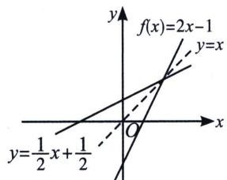
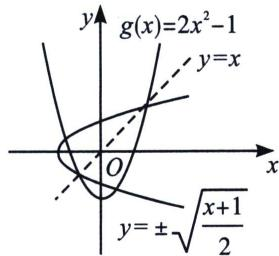

> [!faq]- 《导数专题(上)》例题解析
>
> > [!success]- **【答案】** A
>
> > [!note]- **【分析】**
> > 本题未单列分析。
>
> > [!note]- **【解析】**
> > 解析 $f(x) = \frac{e^{x - 1}}{x} +\frac{x}{e^{x - 1} + x} +a = 0\Leftrightarrow \frac{e^{x - 1}}{x} +\frac{1}{\frac{e^{x - 1}}{x} + 1} +a = 0\Leftrightarrow \frac{e^{x - 1}}{x}\left(\frac{e^{x - 1}}{x} +1\right) + 1 + a\left(\frac{e^{x - 1}}{x} +1\right) = 0$ 令 $h(t) = \frac{t^2}{e^2} +(a + 1)\frac{t}{e} +a + 1$ ，设两根分别为 $t_1,t_2,t_1 + t_2 = -(a + 1)e,t_1t_2 = (a + 1)e^2$ ，令 $g(x) =$ $\frac{e^{x}}{x}$ ，如图，结合 $g(x)=\frac{e^{x}}{x}$ 图像易知 $\frac{e^{x_{1}}}{x_{1}}=t_{1}<0,\quad\frac{e^{x_{2}}}{x_{2}}=\frac{e^{x_{3}}}{x_{3}}=t_{2}>e,$
> > 
> > 由二次函数性质 $a<-\frac{3}{2}$ ，所以 $\frac{2e^{x_{1}}}{x_{1}}+\frac{e^{x_{2}}}{x_{2}}+\frac{e^{x_{3}}}{x_{3}}=2(t_{1}+t_{2})>e$ ，故选 A.
> > ## 三、原函数与反函数综合零点问题
> > 考点1：不动点与稳定点
> > 不动点对于函数 $f(x)(x\in D)$ ，我们把方程 $f(x)=x$ 的解x称为函数 $f(x)$ 的不动点，即 $y=f(x)$ 与y=x图象交点的横坐标.
> > 例如函数 $f(x)=2x-1$ 有一个不动点为1，函数 $g(x)=2x^{2}-1$ 的不动点．有两个不动点 $-\frac{1}{2}$ ，1.
> > 稳定点对于函数 $f(x)(x \in D)$ ，我们把方程 $f[f(x)] = x$ 的解 $x$ 称为函数 $f(x)$ 的稳定点，即 $y = f[f(x)]$ 与 $y = x$ 图象交点的横坐标。很显然，若 $x_0$ 为函数 $y = f(x)$ 的不动点，则 $x_0$ 必为函数 $y = f(x)$ 的稳定点。
> > 证明因为 $f(x_{0})=x_{0}$ ，所以 $f(f(x_{0}))=f(x_{0})=x_{0}$ ，故 $x_{0}$ 也是函数 $y=f(x)$ 的稳定点.
> > ## 例20 求函数 $f(x)=2x^{2}-1$ 的稳定点.
> > 解析 令 $f(f(x)) = x$ ，则 $2(2x^2 - 1)^2 - 1 = x \Rightarrow 2(4x^4 - 4x^2 + 1) - 1 - x = 0 \Rightarrow 8x^4 - 8x^2 - x + 1 = 0$ ，因为不动点必为稳定点，所以该方程一定有两解 $x_1 = -\frac{1}{2}$ ， $x_2 = 1 \Rightarrow 8x^4 - 8x^2 - x + 1$ 必有因式 $(x - 1)(2x + 1) = 2x^2 - x - 1$ ，可得 $(x - 1)(2x + 1)(4x^2 + 2x - 1) = 0 \Rightarrow$ 另外两解 $x_{3,4} = \frac{-1 \pm \sqrt{5}}{4}$ ，故函数 $f(x) = 2x^2 - 1$ 的稳定点是 $-\frac{1}{2}$ ， $1, \frac{-1 + \sqrt{5}}{4}, \frac{-1 - \sqrt{5}}{4}$ ，其中 $\frac{-1 \pm \sqrt{5}}{4}$ 是稳定点，但不是不动点.
> > 
> > 
> > 由此可见，不动点是函数图象与直线 y=x 的交点的横坐标，稳定点是函数 $y=f(x)(x\in D)$ 图象与曲线 $x=f(y)(y\in D)$ 图象交点的横坐标（特别，若函数有反函数时，则稳定点是函数图象与其反函数图象交点的横坐标）.
> > 不动点定理1若函数 $f(x)$ 为定义域内的单调递增函数，则 $f(f(x))=x$ 有解等价于 $f(x)=x$ 有解。证明若 $f(x)=x$ 无解，则必有 $f(x)>x$ ，或 $f(x)<x$ 恒成立，当 $f(x)>x$ 时，因为 $f(x)$ 为定义域内的单调增函数，则 $f(f(x))>f(x)>x$ ，显然 $f(f(x))=x$ 无解；同理，可证 $f(x)<x$ 的情况。因此，函数 $f(x)$ 为定义域内的单调增函数， $f(f(x))=x$ 有解等价于 $f(x)=x$ 有解。
