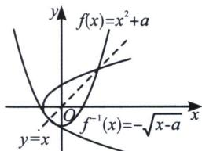

> [!faq]- 《导数专题(上册)》例题解析
>
> > [!success]- **【答案】** 详见解析
>
> > [!note]- **【解析】**
> > 解析 法一设 $y=f(x)$ ，由 $f(f(x))=x$ 得 $y^{2}+a=x$ ，所以 $\left\{\begin{aligned}y^{2}+a&=x\\ x^{2}+a&=y\end{aligned}\right.$ ，两式相减得 $(y-x)(y+x+1)=0$ ，即 y-x=0 或 $y+x+1=0$ ，所以 y-x=0 必有解，即 $x^{2}-x+a=0$ 有解，所以 $\Delta=1-4a\geqslant0\Rightarrow a\leqslant\frac{1}{4}$ ，因为函数 $f(x)=x^{2}+a(x\in\mathbb{R})$ 的稳定点恰是它的不动点，所以 $y+x+1=0$ 无解或者与 y-x=0 同解，当 $y+x+1=0$ 无解时，即方程 $x^{2}+x+a+1=0$ 无解，则 $\Delta=1-4(a+1)<0\Rightarrow a>-\frac{3}{4}$ ，当 $y+x+1=0$ 与 y-x=0 同解时， $\left\{\begin{aligned}x^{2}+x+a+1&=0\\ x^{2}-x+a&=0\end{aligned}\right.$ ，两式相减得 $x=\frac{1}{2}$ ， $a=-\frac{3}{4}$ ，经检验 $a=-\frac{3}{4}$ 满足题意，综上所述 $a\in\left[-\frac{3}{4},\frac{1}{4}\right]$ .
> >
> > 法二如图所示， $f(x)=x^{2}+a(x\in\mathbb{R})$ 的其中一个不动点一定位于 $f(x)=x^{2}+a$ 与 $f^{-1}(x)=\sqrt{x-a}$ 的切点，此时原函数与反函数公切线斜率一定为 -1， $f'(x)=2x=-1\Rightarrow x=-\frac{1}{2}\Rightarrow a=-\frac{3}{4}$ ，当 $f(x)=x^{2}+a$ 只有一个不动点时， $a=\frac{1}{4}$ ，故 $a\in\left[-\frac{3}{4},\frac{1}{4}\right]$ .
> >
> > 
