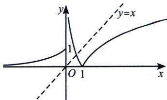
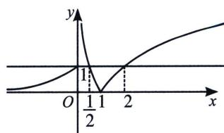
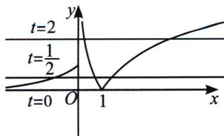
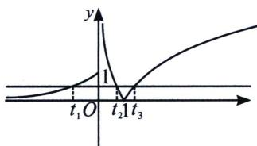
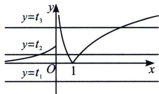
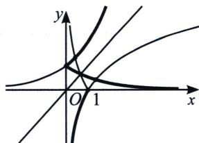

> [!faq]- 《导数专题(上册)》例题解析
>
> > [!success]- **【答案】** AC
>
> > [!note]- **【分析】**
> > 本题未单列分析。
>
> > [!note]- **【解析】**
> > 解析 $x > 0$ 时， $x > \log_2 x$ ，且 $f(x) = \begin{cases} 2^x, & x \leqslant 0 \\ |\log_2 x|, & x > 0 \end{cases}$ ，作出函数 $f(x)$ 的图象如图23-1：
> > 
> > 图23-1
> > 
> > 图23-2
> > 
> > 图23-3
> > 由图可知，直线 $y = x$ 与曲线 $y = f(x)$ 只有一个交点，即方程 $f(x) = x$ 的解只有一个，故A正确；令 $f(x) = t$ ，由 $f(t) = 1$ ，得 $t = 0$ 或 $t = \frac{1}{2}$ 或 $t = 2$ ，如图23-2，由 $t = f(x) = 0$ ，可得 $x = 1$ ，由 $t = f(x) = \frac{1}{2}$ ，由图23-3可知此方程有三个根，由 $t = f(x) = 2$ ，由图23-3可知，此方程有两个根，综上可得，方程 $f(f(x)) = 1$ 的解有六个，故B错误；
> > 
> > 图23-4
> > 
> > 图23-5
> > 
> > 图23-6
> > 由图23-4可知，满足方程 $f(f(x)) = t$ ， $(0 < t < 1)$ 的 $f(x)$ 有三个值，分别设为 $t_1 < 0$ ， $0 < t_2 < 1$ ， $t_3 > 1$ ，由 $f(x) = t_1$ ，得此方程无实数根，如图23-5，由 $f(x) = t_2$ ，得此方程有三个实数根，由 $f(x) = t_3$ ，得此方程有两个实数根，综上可得，方程 $f(f(x)) = t$ ， $(0 < t < 1)$ 的解有五个，故C正确；对于D，这是一个稳定点的问题，令 $y = f(x)$ ，所以本题满足 $f(f(x)) = f(y) = x$ ，即 $y = f(x)$ 与 $x = f(y)$ 的交点，我们用稳定点作图，如图23-6，作 $y = f(x)$ 关于直线 $y = x$ 对称的图像，如粗线表示的部分，两曲线有5个交点，故有5个稳定点，D错误；
> >
> > 故选 **AC**.
