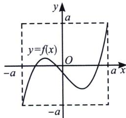
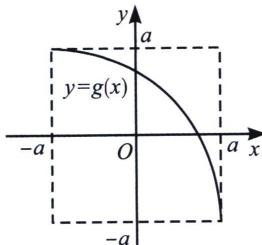

<!-- question-source:start -->
例10 (多选)定义域和值域均为 $[-a, a]$ (常数 a>0) 的函数 $y=f(x)$ 和 $y=g(x)$ 的图象如图所示，下列四个命题中正确的结论是（）

A. 方程 $f[g(x)] = 0$ 有且仅有三个解 B. 方程 $g[f(x)] = 0$ 有且仅有三个解 C. 方程 $f[f(x)] = 0$ 有且仅有九个解 D. 方程 $g[g(x)] = 0$ 有且仅有一个解
<!-- question-source:end -->

![[高中/总复习/专题/2026版高中《mst老唐说题》导数专题（数学）/上册/第05章_小题篇_数形结合/第二节_数形结合与零点问题/考点1_判断嵌套函数零点个数/例题/answers/Q00047264A1.md]]
