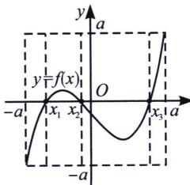
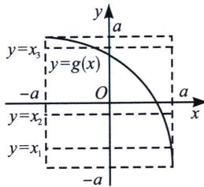
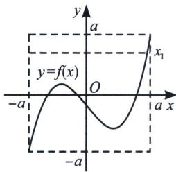
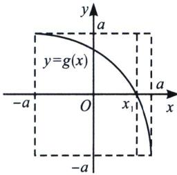
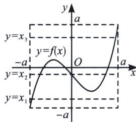
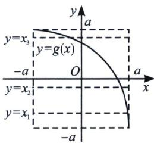
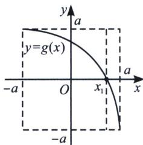
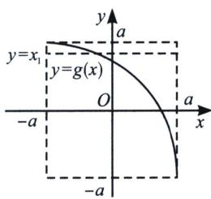

> [!faq]- 《导数专题(上册)》例题解析
>
> > [!success]- **【答案】** AD
>
> > [!note]- **【解析】**
> > 解析 关于 A，当 $f[g(x)]=0$ 时，如图 1，先找到外函数 $y=f(x)$ 的零点 $x_{1}$ ， $x_{2}$ ， $x_{3}$ ，如图 2，再针对内函数分别作出 $y=x_{1}$ ， $y=x_{2}$ ， $y=x_{3}$ ，可得三条横线与 $y=g(x)$ 有三个交点，故 A 正确；
> >
> >   
> > 图 1
> >
> >   
> > 图 2
> >
> > 关于 B，当 $g[f(x)]=0$ 时，如图 3，先找到外函数 $y=g(x)$ 的零点 $x_{1}$ ，如图 4，再针对内函数作出 $y=x_{1}$ 可得一条横线与 $y=f(x)$ 有一个交点，故 B 错误；
> >
> >   
> > 图 3
> >
> >   
> > 图 4
> >
> > 关于 C，当 $f[f(x)]=0$ 时，如图 5，先找到外函数 $y=f(x)$ 的零点 $x_{1}$ ， $x_{2}$ ， $x_{3}$ ，如图 6，再针对内函数分别作出 $y=x_{1}$ ， $y=x_{2}$ ， $y=x_{3}$ ，可得三条横线仅有 $y=x_{2}$ 与 $y=f(x)$ 有三个交点，故 C 错误；
> >
> >   
> > 图 5
> >
> >   
> > 图 6
> >
> > 关于 D，当 $g[g(x)]=0$ 时，如图 7，先找到外函数 $y=g(x)$ 的零点 $x_{1}$ ，如图 8，再针对内函数作出 $y=x_{1}$ 可得一条横线与 $y=g(x)$ 有一个交点，故 D 正确，故选 AD.
> >
> >   
> > 图 7
> >
> >   
> > 图 8
