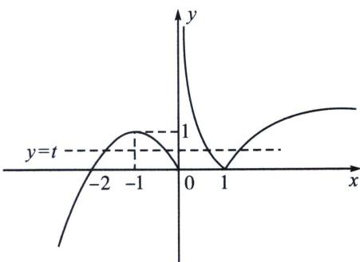
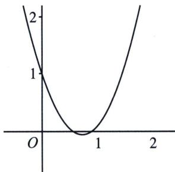

> [!faq]- 《导数专题(上册)》例题解析
>
> > [!success]- **【答案】** D
>
> > [!note]- **【分析】**
> > 本题未单列分析。
>
> > [!note]- **【解析】**
> > 解析 解：函数 $f(x) = \begin{cases} -x^2 - 2x, & x \leqslant 0 \\ |\log_{\frac{1}{2}}x|, & x > 0 \end{cases}$ ，的图象如下，令 $t=f(x)$ ，则求 $h(t)=2t^{2}-mt+1$ 在 $m\in(2\sqrt{2},3)$ 零点的个数，由 $m\in(2\sqrt{2},3)$ 得 $m^{2}\in(8,9)$ ，所以 $\triangle=(-m)^{2}-4\times2=m^{2}-8>0$ ，即方程 $2t^{2}-mt+1=0$ 有两个不相等正根 $t_{1}<t_{2}$ ，对称轴为 $0<t=\frac{m}{4}<1$ ，t=1， $2t^{2}-mt+1=3-m>0$ ，令 $h(t)=2t^{2}-mt+1=0$ ，图像如图：
> > 
> > 
> > 故 $0 < t_{1} < t_{2} < 1$ ， $g(x) = 2[f(x)]^{2} - mf(x) + 1 = h(f(x))$ ，结合 $f(x)$ 图像可知 $f(x) = t_{1}$ 有四个解， $f(x) = t_{2}$ 有四个解，故 $g(x)$ 共有8个零点；
> >
> > 故选 **D**.
