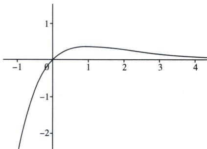

> [!faq]- 《导数专题(上册)》例题解析
>
> > [!success]- **【答案】** A
>
> > [!note]- **【分析】**
> > 本题未单列分析。
>
> > [!note]- **【解析】**
> > 解析 令 $f(x) = ae^{x} - x = 0$ ，则 $a = \frac{x}{e^x}$ ，令 $g(x) = \frac{x}{e^x}$ ，由同构函数：如图
> > 
> > 由题意可知直线 y=a 与函数 $y=g(x)$ 的图象有 2 个交点， $0<a<\frac{1}{e}$ ，
> >
> > 故选 **A**.
