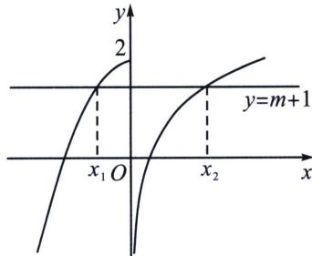

> [!faq]- 《导数专题(上册)》例题解析
>
> > [!success]- **【答案】** 详见解析
>
> > [!note]- **【分析】**
> > 本题未单列分析。
>
> > [!note]- **【解析】**
> > 解析 作出 $y = f(x)$ ， $y = m + 1$ 的图象如下，
> > 
> > 由图象可知，当 $-2 \leqslant m + 1 \leqslant 2$ ，即 $-3 \leqslant m \leqslant 1$ 时，函数 $y = f(x)$ ， $y = m + 1$ 有 2 个交点，即函数 $g(x) = f(x) - m - 1$ 恰有两个不同的零点，因为 $x_1 < x_2$ ，所以 $\left\{ \begin{array}{l} 2 - x_1^2 = m + 1 \\ \ln x_2 + 1 = m + 1 \end{array} \right.$ ，可得 $\left\{ \begin{array}{l} x_1^2 = 1 - m \\ x_2 = e^m \end{array} \right.$ ，则 $x_1^2 + x_2 = e^m - m + 1$ ，构造函数 $h(x) = e^x - x + 1$ ， $(-3 \leqslant x \leqslant 1)$ ，由切线函数： $h(x)$ 在 $[-3, 0)$ 单调递减， $(0, 1]$ 单调递增，所以 $h(x)_{\min} = h(0) = 2$ ， $h(x)_{\max} = \max \{h(-3), h
