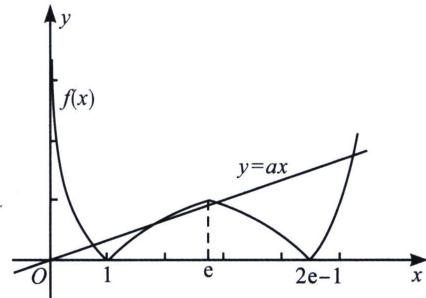

> [!faq]- 《导数专题(上册)》例题解析
>
> > [!success]- **【答案】** A
>
> > [!note]- **【分析】**
> > 本题未单列分析。
>
> > [!note]- **【解析】**
> > 解析 根据函数 $f(x)$ 的解析式可知，函数的图象如下：
> > 
> > 要使方程 $F(x)=f(x)-ax$ 有4个零点，则 $f(x)$ 的图象与直线y=ax有4个不同的交点，所以只需a小于 $y=\ln x$ 在区间 $[1,e]$ 上的过坐标原点的切线的斜率即可，由 $y=\ln x$ ，得 $y'=\frac{1}{x}$ ，设切点坐标为 $(x_{0},y_{0})$ ，则切线方程为 $y-\ln x_{0}=\frac{1}{x_{0}}(x-x_{0})$ ，又切线过 $(0,0)$ ，所以 $-\ln x_{0}=\frac{1}{x_{0}}(-x_{0})$ ，解得 $x_{0}=e$ ，故此时切线的斜率为 $\frac{1}{x_{0}}=\frac{1}{e}$ ，故 $a\in\left(0,\frac{1}{e}\right)$ ，结合选项知，A正确，
> >
> > 故选 **A**.
